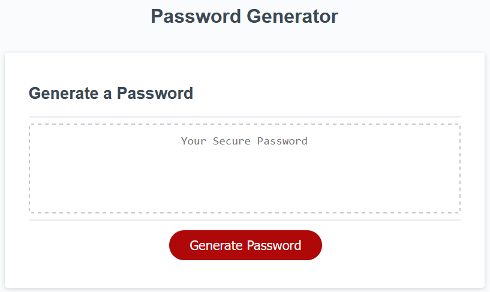

# Password Generator

## Description

This is a random password generator. When the user clicks the **Generate Password** button the `generatePassword()` function is triggered. This function has a `characterBank` object that contains 4 arrays that consist of the character sets (lowercase, uppercase, numerics, and special characters) and a single method `selectType()`. This method creates an array from the character bank with only selected character types, i.e. you can call 
```characterBank.selectType(lower, upper, special)```
and it returns an array with only the characters from `characterBank.lower`, `characterBank.upper`, `characterBank.special` . This is totally unecessary but I wanted to see if I could figure out how to make it work!


The `generatePassword()` function uses the `window.prompt()` method to take user input for the password length and the desired character sets. If the user does not select a password length, does not choose a length between 8 and 128 characters or does not select at least one chartacter type to include in their password then they will be alerted. 


Next the `availableCharacters` array is constructed based on the chosen character sets. Then the `constrcutPassword()` function creates the password by looping for the `chosenLength` amount of times and randomly selecting a character from the `availableCharacters` array and adding it to the `randomPassword` variable. The function then returns this variable, and the output from this is saved in another variable `chosenPassword` and that is returned by the main `generatePassword()` function.


The password generated is then written to the `<textarea>` in the HTML using `document.querySelector`.

## Application Preview

